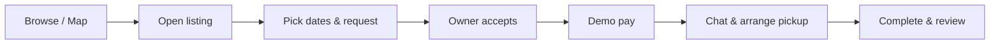
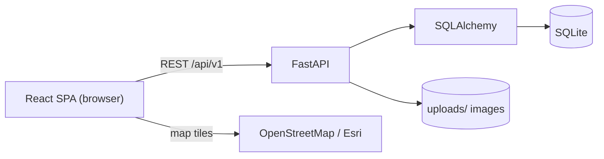
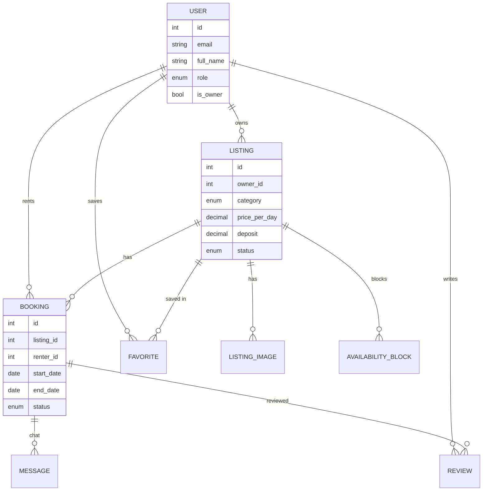
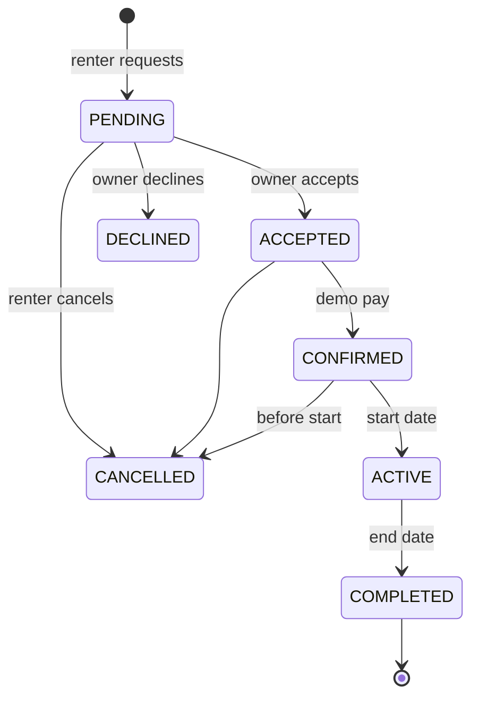
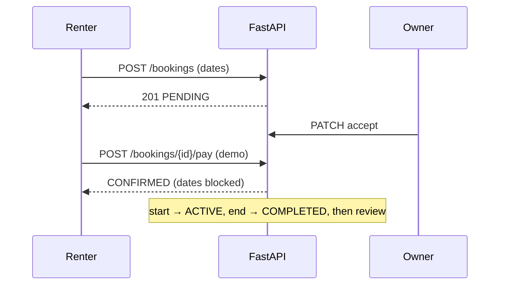

# Rentora

**Rentora is a peer‑to‑peer marketplace for renting event decoration in Georgia** — balloons, backdrops, lighting, props, and photo‑zone sets. People rent what they need for a birthday, party, or photoshoot instead of buying it, and owners earn from items that would otherwise sit idle between their own events.

## What it does

- **Browse & discover** — search, filter (city, category, price, dates), sort, and an interactive map of Georgia.
- **List items** — owners publish listings with photos, a daily price, a refundable deposit, and availability.
- **Book & order** — request dates → owner accepts → demo pay → active → complete.
- **Chat** — per‑booking messaging between renter and owner, with unread badges.
- **Rate** — reviews and star ratings after completed rentals.
- **Accounts** — register/login (JWT), renter/owner profiles, favorites, dashboards.
- **Admin** — overview stats and moderation of users, listings, and bookings.
- **Bilingual (ქართული / English)** with light & dark themes.

## Tech stack

| Layer | Tech |
|------|------|
| **Frontend** | React 19 + TypeScript, Vite, Tailwind CSS v4, React Router, TanStack Query, Leaflet (maps) |
| **Backend** | Python, FastAPI, SQLAlchemy 2, Alembic, Pydantic, JWT (python‑jose), passlib/bcrypt |
| **Database** | SQLite (dev) — Postgres recommended for production |
| **Auth** | JWT bearer tokens |

## How it works (user flow)



Owners follow: **List an item → receive requests → accept/decline → hand over → get reviewed.**

## Architecture



## Data model



## Booking lifecycle





> **Note:** payment is a **demo** — it confirms a booking without charging a real card.

## Getting started (run locally)

**Prerequisites:** Node 20+, Python 3.11+, Git.

```bash
git clone <your-repo-url> rentora
cd rentora
```

You need **two terminals** (backend + frontend).

### 1. Backend (API)

```bash
cd backend
python -m venv .venv
# Windows:        .venv\Scripts\activate
# macOS / Linux:  source .venv/bin/activate
pip install -r requirements.txt
cp .env.example .env          # if .env is missing
alembic upgrade head
python seed.py                # sample data + demo accounts
uvicorn app.main:app --reload --port 8001
```

API docs: http://127.0.0.1:8001/docs

### 2. Frontend (website)

```bash
cd frontend
npm install
cp .env.example .env          # if missing; VITE_API_URL must match the backend port
npm run dev
```

App: **http://127.0.0.1:5173**

### Demo accounts — password `Demo1234!`

| Role | Email |
|------|-------|
| Admin | `admin@rentora.demo` |
| Renter | `renter@rentora.demo` |
| Owner | `owner@rentora.demo` |

## Environment variables

**`backend/.env`**

```
DATABASE_URL=sqlite:///./rentora.db
SECRET_KEY=change-me-in-production
ACCESS_TOKEN_EXPIRE_MINUTES=1440
CORS_ORIGINS=http://localhost:5173,http://127.0.0.1:5173
UPLOAD_DIR=uploads
```

**`frontend/.env`**

```
VITE_API_URL=http://127.0.0.1:8001/api/v1
VITE_UPLOAD_ORIGIN=http://127.0.0.1:8001
```

## Deployment (free hosting)

The frontend is a static SPA and deploys free on **Vercel**:

- Import the repo, set **Root Directory** to `frontend/` (Vite preset, build `npm run build`, output `dist`).
- Set env vars `VITE_API_URL` and `VITE_UPLOAD_ORIGIN` to your deployed backend URL.

The **FastAPI backend** needs a Python host — a free tier on **Render**, **Railway**, or **Fly.io** works. For real hosting, switch SQLite → a managed **Postgres** (free tier) and move `uploads/` to object storage, since serverless/ephemeral filesystems don't persist. Set the backend `CORS_ORIGINS` to your Vercel domain and a strong `SECRET_KEY`.

## Project structure

```
rentora/
├── backend/                 FastAPI app
│   ├── app/
│   │   ├── api/             route handlers
│   │   ├── models/          SQLAlchemy entities + enums
│   │   ├── schemas/         Pydantic request/response models
│   │   ├── services/        business logic
│   │   ├── security.py      JWT & passwords
│   │   └── main.py          entry point
│   ├── alembic/             migrations
│   ├── seed.py              sample data
│   └── requirements.txt
└── frontend/                React + Vite app
    └── src/
        ├── api/             API client
        ├── components/      reusable UI
        ├── context/         auth, language, theme
        ├── pages/           route pages
        └── i18n/            translations (en/ka)
```
